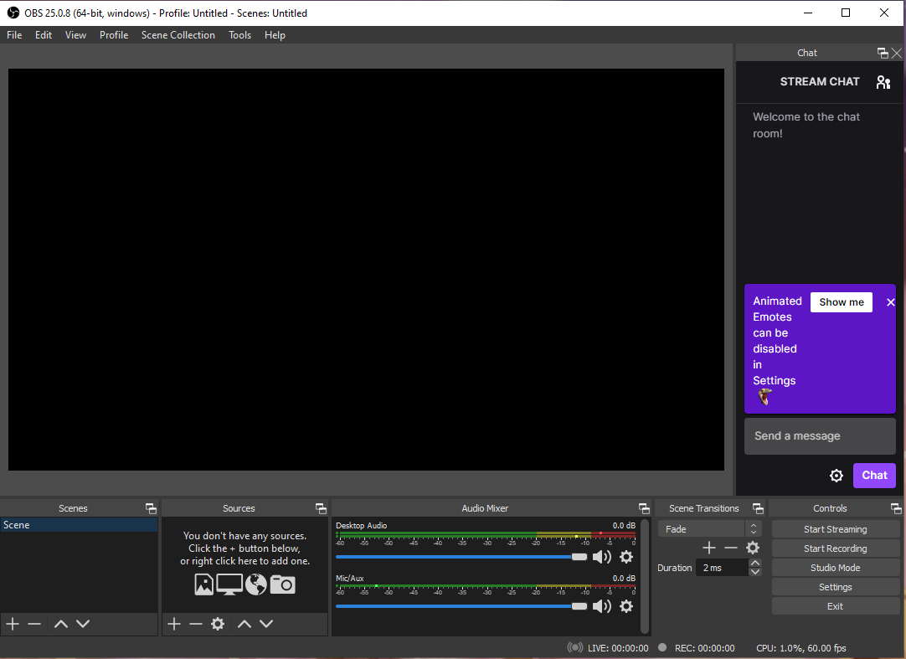
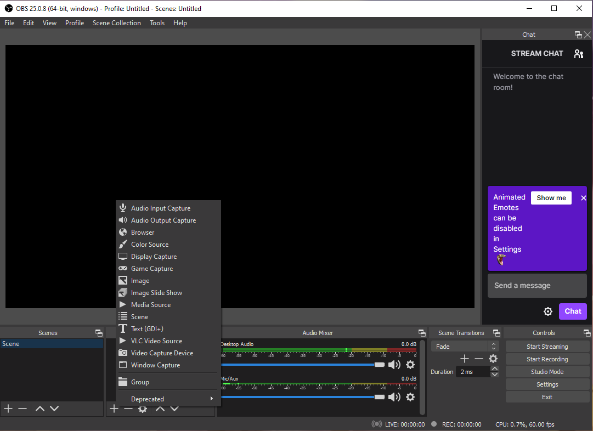
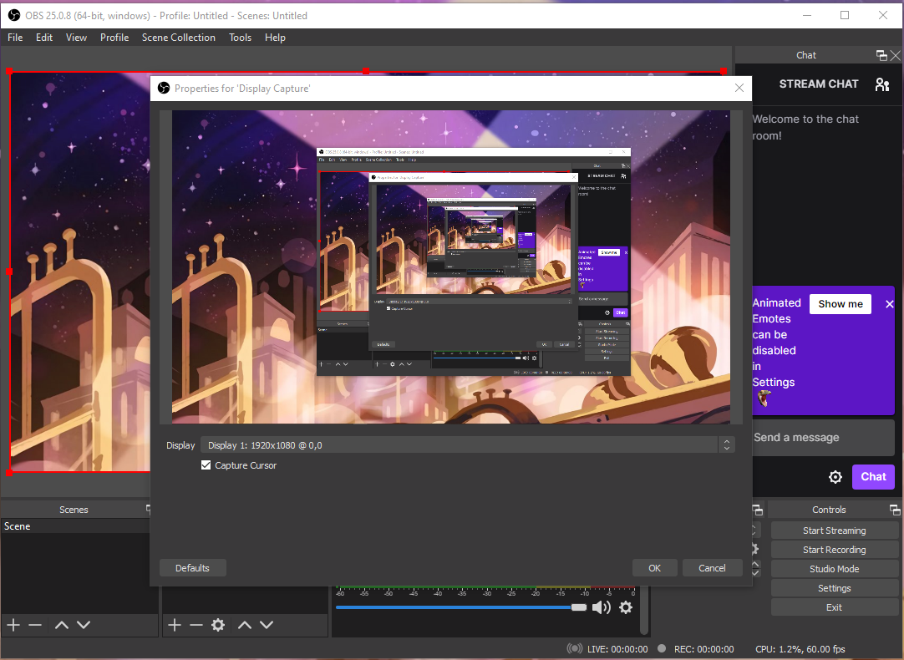

# Figuring out how to show your screen 

Once you are in this window:

you have to press the + sign on the sources section, once you do that a lot of options will show up like this:

You want to make sure you Select "Display Capture" between the options listed.

Click the OK button and the second OK shown below

and now you are ready for the final step!

[Page 1](https://github.com/YousifAlSaeed/Final1600/blob/main/Page1.md). . . . . . . . . . . . . . . . . . . . . . . . . . . . . . . . . . . . . . . . . . . . . . . . . . . . . . . . . . . . . . . . . . . . . . . . . . . . . . . . . . . . . . . . .  [Next Page 3](https://github.com/YousifAlSaeed/Final1600/blob/main/Page3.md)
