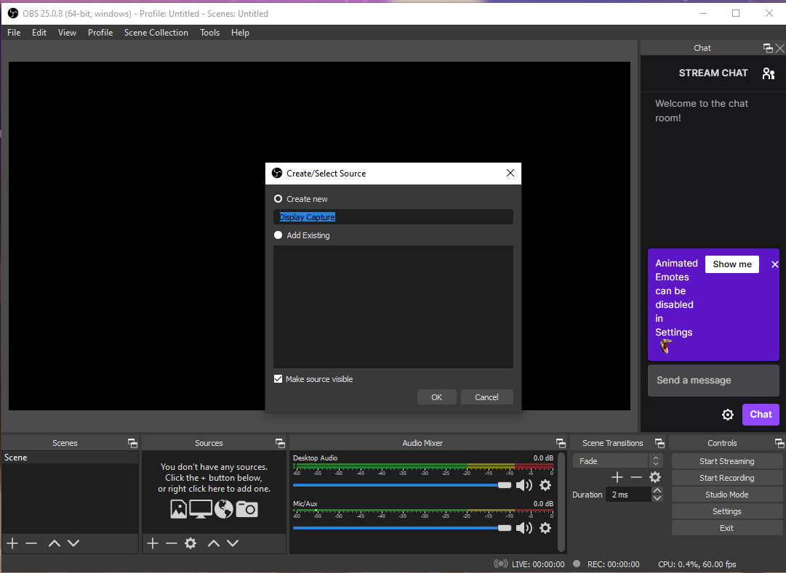

# Figuring out how to show your screen 

Once you are in this window:

you have to press the + sign on the sources section, once you do that a lot of options will show up like this:

You want to make sure you Select "Display Capture" between the options listed.

Click the OK button and you are ready for the next step.
