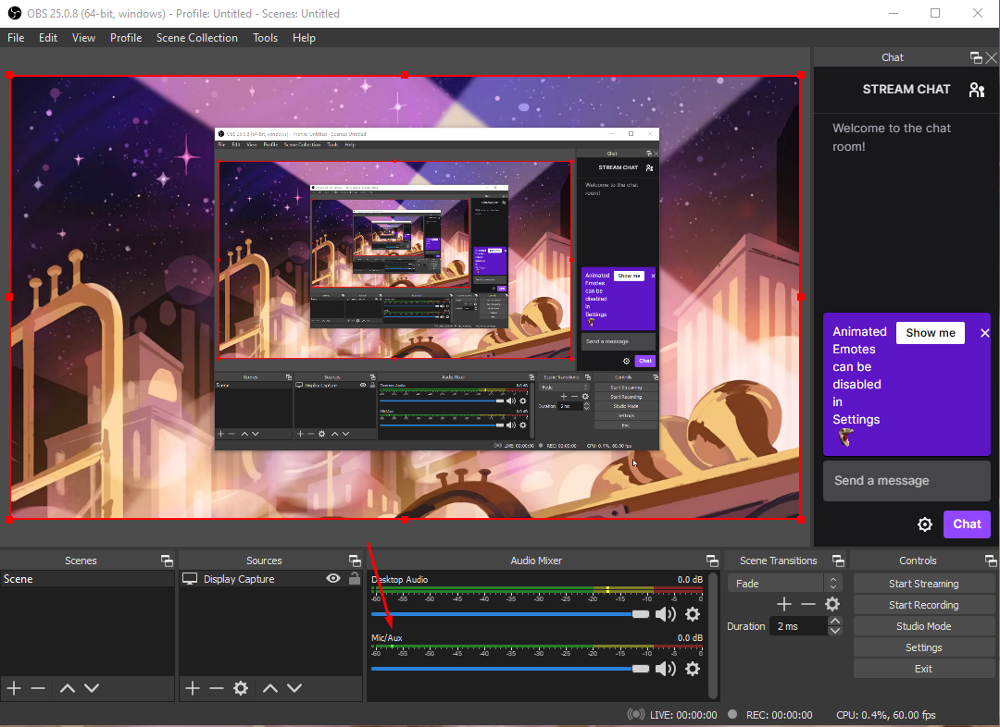
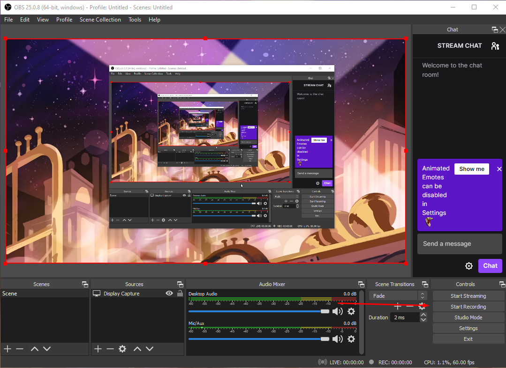
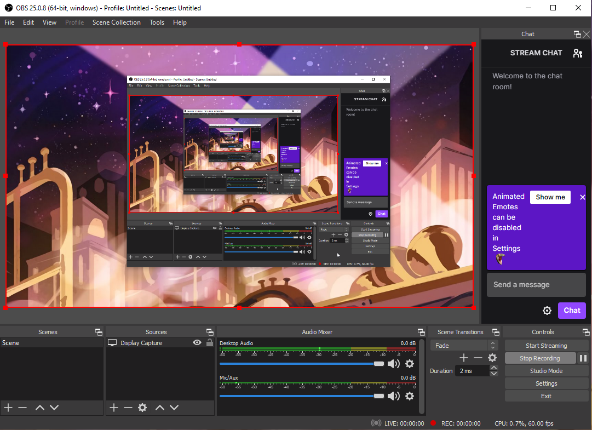

# Understanding OBS layout

In the picture shown below can look at the Desktop Audio meter. you can adjust the volume of the meter to your preference if you want the desktop audio to be recorded as well.

In the second picture shown below you can adjust the Mic volume to your preference as well 

In this picture, this is the record button you have to press to start recording your desktop video 

And once you press it you can either stop the recording when you finish the video or you can pause it if you want to continue later

And now you have mastered how to capture a video in your local computer using OBS studio. 

[Previous Page 2](https://github.com/YousifAlSaeed/Final1600/blob/main/Page2.md). . . . . . . . . . . . . . . . . . . . . . . . . . . . . . . . . . . . . . . . . . . . . . . . . . . . . . . . . . . . . . . . . . . . . . . . . . . . . . . . . . . . . . . . .  [Next Page 4](https://github.com/YousifAlSaeed/Final1600/blob/main/Page4.md)
