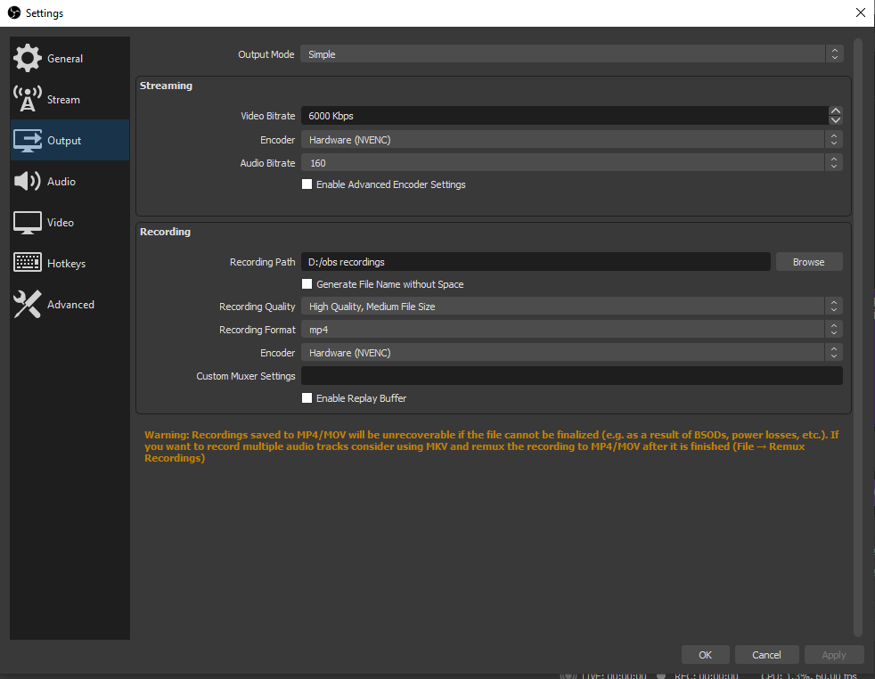

# One bouns thing you have to consider after recording the video

### Once you have recorded your video, you can locate it by going to the following:
### File>Settings>Output 

and this window should pop up for you:

[previous Page 3](https://github.com/YousifAlSaeed/Final1600/blob/main/Page3.md)

And you can see where the video file is located
